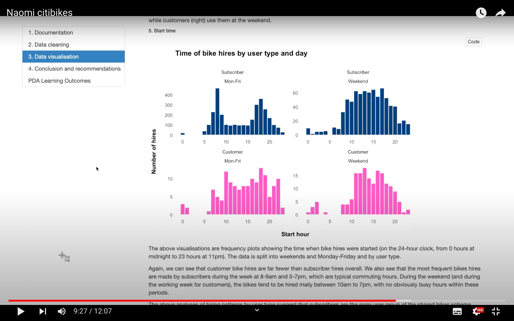

# NYC Citibike
 
Coursework and evidence from **NYC Citi bikes project** for SQA PDA in Data Science.
 
## About the project
 
This project was to produce an analytic report containing business insights for a non-technical audience, aimed at business executives involved with the NYC Citibikes scheme. The report, and a presentation of its contents, were produced over 4 days as a solo project for the CodeClan Professional Data Course (July 2023) and as evidence for the PDA qualification.

The recorded presentation can be viewed on YouTube: 

The video is ~12 minutes and shows me scrolling through and explaining the .html report included in this repository.

## About the data

The data used is a time series data frame available from `tsibbledata` package: `nyc_bikes` contains information about 4,268 individual hires of 10 bikes in 2018 as a sample from NYC's Citibikes scheme.

The data includes information about the **start and end location and time** of the hire, and the **user type and demographics**: where type is subscriber (annual membership) or customer (1 or 3-day pass) and demographic data is the user's year of birth and gender.

## Project files

Project files include:
 
* nyc_bikes/
  * analysis/
    * analysis_pda_report.Rmd - _final analysis report, including information about the business domain and data flow, data ethics and quality, data wrangling and cleaning steps, and visualisations and statistics. Insights and business-relevant recommendations are noted throughout and summarised at the end._
    * exploration_playground.Rmd - _a supporting notebook with additional exploration and plots, not all have been included in the report._

## Process notes

_PDA evidence: 3.7 Writing documentation for function/program_

### 1. Data cleaning and wrangling

Additional variables were added, with calculated rider age and bike hire duration, as well as extracted date-time elements from the start and end times.

The data is mostly clean in its raw state, so the only cleaning steps involved recoded to NA a few unreasonable values for rider age and hire duration.

A tibble format of the wrangled and cleaned data was also made to use in summary statistics (without the timeseries index column, start_time).

### 2. Analysis

Through analysis of bike hire frequency and bike hire duration (KPIs for bike hire service) according to user demographics, user type, hire location, dates and times, I have found insights about:

* Who uses the bikes
* Where hires begin
* The busiest time periods
* Patterns in how different types of users use the bikes

