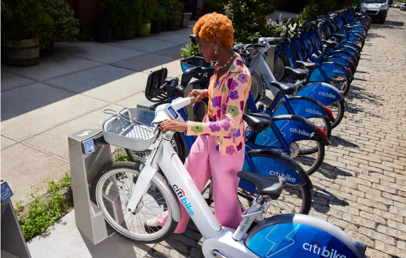
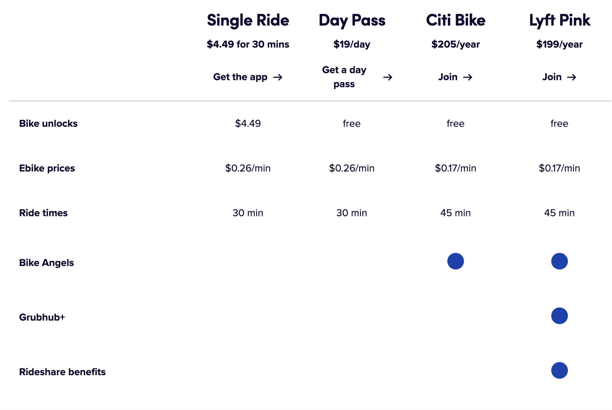
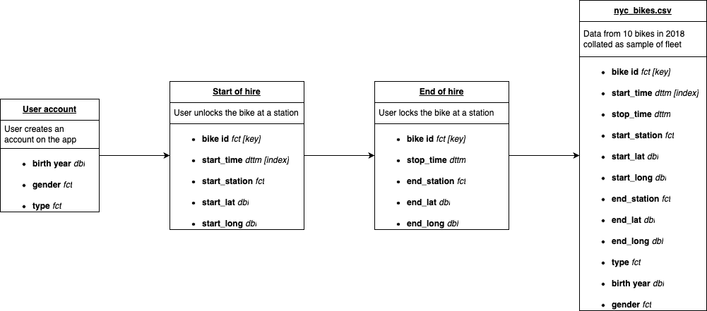

```{r message = FALSE}
# required packages
library(tidyverse)
library(tsibbledata)
library(tsibble)
library(lubridate)
library(leaflet)
#library(forcats)
library(infer)
library(slider)
```

# 1. Documentation

#### Domain knowledge (1.1)

NYC Citi Bikes hired its first bike in May 2013 as part of a new scheme to provide a shared fleet of road bikes for people to use to get around New York City. This scheme is similar to the shared bikes we see in many other cities around the world.

These bikes are available 24/7 every day of the year, and users pick them up at specially designed stations across the city area and can drop them off at any station. Any user looking to hire a bike to ride today can pick one up from stations in Manhattan, Brooklyn, Queens, The Bronx, Jersey City or Hoboken, using an app operated by Lyft. Both classic and electric bikes are available.



_Image source: [Citibike NYC](https://citibikenyc.com/how-it-works)_

The scheme was initiated by the NYC Department of Transport (DOT). In 2013, 6000 bikes were made available at stations across Manhattan and Brooklyn. From 2014 to 2017, the scheme was expanded both in number of bikes in the system and in number of stations, with expansion to also include Queens and Jersey City. In 2018, further investment from Lyft promised to expand the scheme to include 40,000 bikes and more than double the service area within five years (i.e. by 2023).

NYC Citi Bikes is currently operated by Lyft. From 2014 to 2018, it was operated by a subsidiary of Motivate! LLC (previously known as Alta Bicycle Share), which operates several bike sharing schemes across North America and was acquired by Lyft in 2018.

The scheme has also received sponsorship and/or investment from Citibank (hence the name), MasterCard and Goldman Sachs.

##### Pricing 

As far as I can tell, the scheme is intended as an affordable service to improve individual mobility and health without adding to traffic and pollution in the city. However it is not a free service.

The pricing structure is multi-level, with memberships for regular users ("Subscribers") and PAYG charges for irregular users ("Customers"):



Image source: https://citibikenyc.com/pricing 

Regular memberships are approximately USD 17/month and provide unlimited 45-minute rides on classic bikes, with an additional charge (17 cents/min) for the use of electric bikes. Some residents receive reduced rate memberships ($5/month; [source: citibikenyc](https://help.citibikenyc.com/hc/en-us/articles/360032341231-Reduced-Fare-Bike-Share).

Non-members can ride a classic bike for USD 4.49 per ride for the first 30 minutes (and an addition 23 cents for every minute thereafter / $4 for every 15 minutes) or ride an electric bike for 27 cents per minute. Alternatively, non-members can take unlimited 30-minute bike rides over a 24-hour period with a USD 19-day pass, with an additional charge for using electric bikes.

Overall, electric bike hires incur additional fees; they are more expensive than classic bikes.

Sources:

* https://ride.citibikenyc.com/about/
* https://ride.citibikenyc.com/pricing/
* https://help.citibikenyc.com/ (multiple FAQ pages)
* https://www.nyc.gov/html/dot/html/pr2014/pr14-087.shtml 
* https://ride.citibikenyc.com/blog/citi-bike-is-going-to-dramatically-expand
* https://en.wikipedia.org/wiki/Motivate_(company)
* https://altago.com/news/alta-bicycle-share-has-new-name-motivate/

  
#### Business requirements (1.2)

This report documents the following steps taken to analyse the NYC Citi Bikes data and produce and communicate business-relevant insights:

1. Understand the data and business situation through online research and inspecting the provided data contents
2. Clean and wrangle the provided data sample to prepare for analysis and visualisation
3. Explore, visualise and analyse to find interesting patterns in the data that relate to business KPIs
4. Produce insights and recommendations for a non-technical audience, including ensuring graphs and written explanations are clear and informative

#### Business processes and data flow (1.3)

The dataset used was created through the following business processes and data flow:



#### Data visualisation as a tool for decision-making (1.4)

I have analysed the available data using the following _key performance indicators (KPIs)_:

* **Number of hires** - we can use this as an indicator of usage of the bike hire scheme, we can measure the number of hires by start/stop location, by time (of day, of year), and proportion of hires made by different user demographics (for example, rider age, gender and type of customer (membership subscriber, or short-term pass customer)).
* **Hire duration** - while we cannot determine the exact route taken between the start and stop stations, we can measure the time the bike was unlocked for, which directly impacts the hire income. Subscribers can hire a classic bike for free for up to 45 minutes each ride, but are then charged 17c per minute for each additional minute thereafter in a single ride. Similarly, customers can hire a bike for up to 30 minutes and are charged $4 for every 15 minutes thereafter. Therefore, the hire duration is an indicator of income from these additional charges.

We can use data to understand how bikes are being used, for example: the busiest start stations, who uses the bikes here, and where do they drop them off. We can also explore any differences in how Customers (PAYG users) versus Subscribers (annual membership fee), and consider what could be done to increase usage by a particular group of users (by type, age, gender).

To inform business strategy, I have analysed the provided data and found insights about:

* Who uses the bikes?
* At which stations do hires begin?
* When are the busiest time periods?
* Patterns in how different types of users use the bikes

These insights can support decision-making across the business, including in marketing (e.g. which prospective users to target to increase hires on a specific day/time or location), logistics (e.g. which stations may require the most maintenance) and development (e.g. which locations could be useful to add (new) or deprecate (existing)).

#### Data types (1.5)

```{r}
class(nyc_bikes)
dim(nyc_bikes)
```

The data is a time series data frame that contains information about 4,268 individual hires, with 12 variables.

```{r}
key_vars(nyc_bikes)
index_var(nyc_bikes)
```

The key variable is bike_id - this is the unique identifier for each of the 10 individual bikes included in this sample.

The index variable is start_time - all time series analysis is indexed by this datetime value, which is the date and time at which the bike was unlocked at the start station.

```{r}
glimpse(nyc_bikes)
```

The other 10 variables provide information about:

* the **start location** for the hire: 
  * `start_station` is the unique id of the station the bike was hired from
  * `start_lat` and `start_long` are the latitude and longitude coordinates of the start station location
* the **stop location and time** for the hire: 
  * `stop_time` is the date and time when the hire ended (the bike was returned and locked up at a station)
  * `stop_station` is the station id where the bike was returned
  * `stop_lat` and `stop_long` are the stop location coordinates (latitude, longitude)
* the **user type and demographics**: 
  * `type` is either Subscriber or Customer, where Subscriber has an annual subscription ("membership") and Customer has purchased a short-term pass (24-hour or 3-day)
  * `birth_year` is the user's year of birth
  * `gender` is the user's gender from: "Male", "Female" or "Unknown"

The variables are of the following types:

* **Date-time** (<dttm>): the year, month, date and time (hours, minutes and seconds) as a timestamp, used in `start_time` and `stop_time` variables
* **Factor** (<fct>): discrete categorical data with a specified order (or level), both numeric (`bike_id`, `start_station`, `end_station`) and character (`type` and `gender`)
* **Double** (<dbl>): numeric data, both continuous (`start_lat`, `start_long`, `end_lat`, `end_long`) and discrete (`birth_year`)

#### Data quality and data bias (1.6)

The data contains a sample of 2018 bike usage, sampling 10 bikes with data about when and where they were hired (start and stop datetimes and locations) and who by (type of customer (subscriber or customer), user birth year and gender).

##### Data ethics

When using data about individuals' demographics and activities, we must take care not to disclose personal information or produce insights that could lead to harm (intentional or not).

I am not concerned about the use of the `nyc_bikes` data because the data does not contain individual user IDs or identifiable user information: we cannot identify any individuals who have hired a bike or determine patterns in how an individual uses the service, such as the locations at which they typically start and end a bike hire. 

Further, the data is a small sample of ~4,000 hires of 10 bikes over a whole year, out of a fleet of thousands. The sample is small enough that we cannot determine the true busiest bike stations and times (which could be misused), although this also limits the validity of the insights within this report.

##### Data quality

We do not know whether this sample is representative of citibikes users and usage overall. As noted above, the sample is small. In addition, the start locations all appear to be in Jersey City, whereas the scheme runs in multiple neighbourhoods in New York City. Therefore, there is potential for this sample to be biased.

In addition, as well as taking some steps to clean some unreasonable data values (ages of 130 and 131, bike hire durations of 1000s minutes), there are 243 observations where age is 49 and gender is "Unknown". These have been included in the data but produce an unusual peak in the age patterns (when not separated by gender) and may be due to a data entry error (birth year = 1969) rather than representing real information. _Please bear this in mind when evaluating any insights about age._

# 2. Data cleaning

#### Preparing data for visualisation (1.7)

##### Check for NAs

```{r, warning=FALSE}
as.tibble(nyc_bikes) %>% 
  summarise(across(
    .cols = everything(),
    .fns = ~ sum(is.na(.x))
  )) 
```

No NAs were found in the original data file.

##### Data cleaning & wrangling

There is no reformatting needed for date-time data values, because:

* `start_time` and `stop_time` are already in [ISO 8601](https://www.iso.org/iso-8601-date-and-time-format.html) format (the standard data class for date-time values, encoded here as <S3: POSIXct> class) so they do not need to be converted. 
* since this data is all about bikes in NYC, I am not converting timezone because it won't affect any calculated data.

However, the year, month, etc can be extracted from these variables, to enable analysis of hires over time as well as calculate rider age at time of hire. Some unusual data values can also be recoded (see cleaning steps below).

After data wrangling and cleaning, the data includes:

```{r}
nyc_bikes_wrangled <- nyc_bikes %>% 
  mutate(
    # extract elements from start_time
    start_year = year(start_time),
    start_month = month(start_time, label = TRUE, abbr = TRUE),
    start_day = day(start_time),
    start_weekday = wday(start_time, label = TRUE, abbr = TRUE),
    start_hour = hour(start_time),
    start_minute = minute(start_time),
    # make start dates and times
    start_date = make_date(year = start_year, month = start_month, day = start_day),
    start_timestamp = hm(str_c(as.character(start_hour),":",as.character(start_minute))),
    # extract same elements from stop_time
    stop_year = year(stop_time),
    stop_month = month(stop_time, label = TRUE, abbr = TRUE),
    stop_day = day(stop_time),
    stop_weekday = wday(stop_time, label = TRUE, abbr = TRUE),
    stop_hour = hour(stop_time),
    stop_minute = minute(stop_time),
    # make stop dates and times
    stop_date = make_date(year = stop_year, month = stop_month, day = stop_day),
    stop_timestamp = hm(str_c(as.character(stop_hour),":",as.character(stop_minute)))
    ) %>%
  # calculate additional variables
  mutate(
    # calculate ride duration in different units (hours, mins)
    ride_duration_period = as.period(stop_time - start_time),
    ride_duration_hours = as.numeric(ride_duration_period, "hours"),
    ride_duration_mins = as.numeric(ride_duration_period, "minutes"),
    # calculate rider age in years
    rider_age = start_year - birth_year
    )

nyc_bikes_clean <- nyc_bikes_wrangled %>% 
  mutate(
        # (NOT USED) recode age to NA for 243 rows where age is 49 & gender is unknown
        # because this is an unusual peak in our age frequency data, suspect not real
        # rider_age = if_else(
        #                 rider_age == 49 & gender == "Unknown",
        #                 NA_integer_,
        #                 rider_age),
        # # recode riders over 100 to NA, 2 values of 130 and 131
        rider_age = if_else(rider_age > 100, NA_integer_, rider_age),
        # recode ride duration to NA if over 180 minutes
        # recodes 10 values, suspect not locked at a station at end of individual ride
        ride_duration_mins = if_else(
                        ride_duration_mins>180,
                        NA_integer_,
                        ride_duration_mins))

glimpse(nyc_bikes_clean)
```

The data wrangling has added 20 columns, for use in exploration and analysis, including:

* `start_month`, `start_weekday` and `start_timestamp` are all extracted values from `start_time`: the month, day of the week (Monday - Sunday) and time (hours, minutes, seconds) at the start of the bike hire
* `ride_duration_mins`, which is the number of minutes between `start_time` and `stop_time`
* `rider_age`, which is `start_year` minus `birth_year`

The wrangled data is stored as a tsibble: `nyc_bikes_wrangled`.

The data cleaning steps involved:

* recoding 2 rider_age values greater than 100 to NA, since these ages are not possible (values: 130, 131 years)
* recoding 10 ride_duration values greater than 180 minutes to NA, since these were unusually high values, likely to represent bikes that were not locked up at end of hire

The cleaned data is stored as a tsibble: `nyc_bikes_clean`.

```{r warning = FALSE}
# make a tibble to use to visualise summary information (without datetime index)
nyc_bikes_summary <- as.tibble(nyc_bikes_clean)
```

In order to do summary analyses of the data, without using the start_time index, I have also stored a version of `nyc_bikes_clean` as a tibble (df) called `nyc_bikes_summary`.

# 3. Data visualisation

#### Process and design (2.1, 2.7, 2.8, 2.9)

To analyse the data, I first investigated who was hiring the bikes (rider gender, age, and type, where the bikes were being hired from (start location) and when the bikes were being used (months, days of the week, times of day). 

Next, I explored relationships between rider demographics (such as age versus gender) as well as with measures of bike hire usage (number of hires, hire duration). During the exploration, I produced visualisations and summary statistics to help explore the data and find insights of interest.

Finally, I focussed on exploring bike hire usage (number of hires, duration, time of hiring) by different types of user (subscriber and customer) to understand how bikes are used by different user groups. I also calculated the potential additional income from bike hires longer than the 30 or 45 minute hires "included" in the user account (by type, subscriber and customer, respectively).

This report contains visualisations and summary statistics that convey the most informative and business-relevant insights, selected from a broader set of analyses. Insights that show a difference in bike hire usage between groups have been prioritised; there were several other analyses that indicated no relationship (for example between rider age and bike hire duration), which have not been reported here but may be interesting and valid to inform business decisions.

The visualisations were prepared in RStudio using the `ggplot2`, `leaflet` and `infer` packages for R, and using the brand colours of Citibank (dark blue, red) and Lyft (pink). Axis scaling, facetting, themes, and a colorblind-friendly colour palette have been used where appropriate to visualisations are readable and the main story of the data is front and foremost.

```{r}
# set up color palette for citibank and lyft
lyft_pink <- "#FF00BF"
citibank_darkblue <- "#003A72" 
citibank_red <- "#DB230B"
```

#### Visualisations (2.2, 2.3, 2.4, 2.5, 2.6)

##### 1. Rider demographics

```{r warning = FALSE}
nyc_bikes_summary %>% 
  summarise(count = n(),
            prop = n()/nrow(nyc_bikes_summary),
            .by = gender)

nyc_bikes_summary %>% 
  filter(gender != "Unknown") %>% 
  ggplot() +
  geom_bar(aes(x = rider_age, fill = gender), colour = "white", line = 1) +
  scale_fill_manual(values = c(citibank_red, citibank_darkblue), guide = "none") +
  facet_wrap(~ gender, ncol = 1) +
  labs(x = "\nRider age (years)", y = "Number of hires\n",
       title = "Bike hires by user age and gender\n") +
  theme_minimal() +
  theme(panel.grid = element_blank(),
        title = element_text(face = "bold"))
```

This visualisation is a bar plot showing the number of hires made by riders according to their age at the time of hire and separated by specified gender (Male, Female; _excluding 269 "Unknown", of which 243 have a birth year of 1969_).

We can see that the majority of hires are made my male users (3069, 72%) and for male and female users, most hires are made by riders between 25 and 40 years of age. 

This information indicates that the main user demographic of the citibikes scheme are adults aged 25-40, although there are several hires made by riders above this age, and there is potential to increase bike hires in the above-40 age bracket. Approximately three times as many hires are made by male users than females, so there is potential to grow bike usage by females.

##### 2. Busiest start locations

``` {r}
# calculate number of hires by start location
start_freq <- nyc_bikes_summary %>%
  count(start_station, start_long, start_lat) %>%
  # create label for popup on map
  mutate(popup = str_c("Station: ", start_station,
                       "; unlock count: ", n),
         prop_perc = 100*(n/sum(n))) %>%
  arrange(desc(prop_perc))

# function to colour marker by count (heat intensity)
palette <- colorNumeric(
  palette = "plasma",
  domain = start_freq$n
)

# plot map marking start locations coloured by hire frequency
leaflet(start_freq) %>% 
  #addTiles() %>%
  # addProviderTiles(providers$Thunderforest.Transport,
  #                  options = providerTileOptions(opacity = 0.35)) %>%
  #addProviderTiles(providers$CartoDB.Positron) %>%
  addProviderTiles(providers$Stamen.TonerLite) %>%
  #addProviderTiles(providers$CyclOSM) %>%
  addCircleMarkers(
    lng = ~start_long,
    lat = ~start_lat,
    popup = ~ popup,
    stroke = TRUE,
    color = "black",
    opacity = 1,
    weight = 2,
    fillColor = ~ palette(n),
    fillOpacity = 1,
    radius = 6
  ) %>% 
  addLegend(position = "topleft", pal = palette, values = ~ n, 
            title = "Number of hires", opacity = 1) %>% 
  # set centre of map close to station 3195
  # set zoom level to clearly show all stations
  setView(lng = -74.07, lat = 40.729, zoom = 12.5)
```

This visualisation plots bike stations locations around Jersey City using OpenStreetMap (with design by Stamen Design). The markers are coloured according to the number of hires started at each location, with the busiest stations coloured yellow and the least busy stations coloured purple. (Any stations that were not start locations for hires in this dataset are not marked.)

The marker colours show there are some stations at which bike hires are started much more often than other stations. In particular, **station 3186** was the busiest pick-up station in this sample of data, with **434 unlocks (10.2% of all hires)** at this location: this station is at the intersection of Grove Street and Christopher Columbus Drive, close to Grove Street Metro station. The next busiest location was station 3203 (278 unlocks; 6.5% of hires) on McWilliams Place next to Hamilton Park.

It may be important to ensure that bike availability remains high at the more popular start locations, to support user satisfaction. 

Locating bike stations next to popular Metro and bus stations may encourage public transport users to complete their journeys by bike. In addition, it is interesting that the second most frequently used pick-up station is next to a park, which suggests any planning of additional bike stations could include co-location with popular attractions and outdoor relaxation spots.

Finally, additional marketing and campaigns could help raise awareness of the less used bike stations to encourage nearby prospective riders to use bikes from these locations.

##### 3. Seasonal hiring pattern

```{r warning = FALSE}
hire_freq_rolling <- nyc_bikes_clean %>% 
  index_by(start_date) %>% 
  summarise(freq = n()) %>%
  mutate(freq_moving_avg = slide_dbl(
      .x = freq, 
      .f = ~ mean(., na.rm = TRUE),
      .before = 10,
      .after = 10,
      .complete = TRUE
    ))

hire_freq_rolling %>%
  ggplot() + 
  geom_line(aes(x = start_date, y = freq), colour = citibank_darkblue, alpha = 0.5) +
  geom_line(aes(x = start_date, y = freq_moving_avg), colour = lyft_pink, size = 2) +
  labs(x = "\nStart date", y = "Number of hires\n",
       title = "Bike hires throughout the year\n") +
  theme_minimal() +
  theme(panel.grid = element_blank(),
        title = element_text(face = "bold"))
```

The time series line graph shows the number of total hires for each day in 2018 (in dark blue) with the 21-day rolling average (in pink).

It indicates the busiest periods for the bike hire scheme are the summer months, in particular August (according to this sample of 10 bikes). Meanwhile, there are far fewer hires from November through to March. 

This pattern may be due to users preferring to ride bikes during pleasant weather and/or during longer daylight hours.To increase the number of bike hires, you could consider advertising the scheme during times of better weather, including in the months surrounding July and August (May, June and September).

```{r eval = FALSE}
nyc_bikes_clean %>%
  index_by(start_month) %>% 
  summarise(freq = n()) %>% 
  ggplot() + 
  geom_col(aes(x = start_month, y = freq, fill = start_month %in% c("Jul", "Aug"))) +
  scale_fill_manual(values = c(citibank_darkblue, lyft_pink), guide = "none") +
  labs(x = "\nStart date", y = "Number of hires\n",
       title = "Bike hires throughout the year\n") +
  theme_minimal() +
  theme(panel.grid = element_blank(),
        title = element_text(face = "bold"))

# This is a frequency plot of the number of hires in 
# each calendar month (from the start time of the hire).
```

##### Hiring patterns by rider type

###### 4. Weekday

```{r}
nyc_bikes_summary %>% 
  mutate(type = factor(type, levels = c("Subscriber", "Customer"))) %>% 
  ggplot() + 
  aes(x = start_weekday, fill = type) +
  geom_bar(stat = "count", show.legend = FALSE) +
  scale_fill_manual(values = c("Customer" = lyft_pink,
                               "Subscriber" = citibank_darkblue)) +
  facet_wrap( ~ type) +
  labs(x = "\nStart day", y = "Number of hires\n",
       title = "Bike hires by weekday\n") +
  theme_minimal() +
  theme(panel.grid = element_blank(),
        title = element_text(face = "bold"))
```

This visualisation is a histogram (frequency bar plot) show the number of hires made on each weekday for each user type. 

The majority of hires are made by subscribers (left), who use tend to use the bikes more during the working week (Monday - Friday), while customers (right) use them at the weekend.

###### 5. Start time

```{r}
nyc_bikes_clean %>%
  mutate(day_type = if_else(start_weekday %in% c("Sat", "Sun"),
                            "Weekend", "Mon-Fri")) %>% 
  mutate(type = factor(type, levels = c("Subscriber", "Customer"))) %>% 
  index_by(start_hour) %>% 
  ggplot() + 
  geom_histogram(aes(x = start_hour, fill = type), bins = 24, colour = "white", size = 0.5, show.legend = FALSE) +
  scale_fill_manual(values = c("Customer" = lyft_pink,
                               "Subscriber" = citibank_darkblue)) +
  facet_wrap(type ~ day_type, ncol = 2, scales = "free") +
  labs(x = "\nStart hour", y = "Number of hires\n",
       title = "Time of bike hires by user type and day\n") +
  theme_minimal() +
  theme(panel.grid = element_blank(),
        title = element_text(face = "bold"))
```

The above visualisations are frequency plots showing the time when bike hires were started (on the 24-hour clock, from 0 hours at midnight to 23 hours at 11pm). The data is split into weekends and Monday-Friday and by user type.

Again, we can see that customer bike hires are far fewer than subscriber hires overall. We also see that the most frequent bikes hires are made by subscribers during the week at 8-9am and 5-7pm, which are typical commuting hours. During the weekend (and during the working week for customers), the bikes tend to be hired maily between 10am to 7pm, with no obviously busy hours within these periods.

The above analyses of hiring patterns by user type suggest that subscribers are the main user group of the shared bikes scheme, with many using them during peak commuting hours during the typical working week (Monday to Friday). These users could be prioritised in business decisions.

Additionally, these data indicate that there could be potential for growth in bike hires by customers, particularly during the weekend and daytime hours Monday to Friday, when the bikes are less used by commuting subscribers.

###### 6. Hire duration

```{r}
# proportion rides <= 60 mins
nyc_bikes_summary %>%
  filter(ride_duration_mins <= 60) %>% 
  summarise(prop = n()/nrow(nyc_bikes_summary))

# proportion rides less than 10 mins
nyc_bikes_summary %>% 
  filter(ride_duration_mins <= 10 & ride_duration_mins >= 2) %>% 
  summarise(prop = n()/nrow(nyc_bikes_summary))
```

```{r}  
# ride duration by hire type
nyc_bikes_summary %>% 
  mutate(type = factor(type, levels = c("Subscriber", "Customer"))) %>% 
  filter(ride_duration_mins <= 60) %>% 
  ggplot(aes(x = ride_duration_mins, fill = type)) +
  geom_boxplot() +
  scale_fill_manual(values = alpha(c("Customer" = lyft_pink, 
                                     "Subscriber" = citibank_darkblue),
                                   c(1,0.8))) +
  labs(x = "\nHire duration (minutes)",
       title = "Duration of bike hire by user type\n",
       fill = "User type") +
  theme_minimal() +
  theme(panel.grid = element_blank(),
        title = element_text(face = "bold"),
        axis.text.y = element_blank(),
        axis.ticks.y = element_blank())
```

Overall, almost all (99%) bike hires are for 60 minutes or less, with 72% between 2 and 10 minutes in duration.

This visualisation is a boxplot of bike hire duration for all values up to 60 minutes: bike hire duration is plotted for customers and subscribers, with the boxplot showing the range of values, including the median values (central line), and first and third quartiles (box width).

This plot indicates that customers (with short-term passes) hire individual bikes for longer than subscribers (with annual membership subscriptions). 

```{r}
# test for skewness
nyc_bikes_summary %>% 
  filter(ride_duration_mins <= 60) %>% 
  group_by(type) %>% 
  summarise(skewness = e1071::skewness(ride_duration_mins, type = 2))
```

The distribution of bike hire duration for Subscribers is highly positively skewed (towards shorter hires). 

```{r}
# five number summary - Customer
nyc_bikes_summary %>% 
  filter(ride_duration_mins <= 60 & type == "Customer") %>% 
  select(type, ride_duration_mins) %>% 
  summary()

# five number summary - Subscriber
nyc_bikes_summary %>% 
  filter(ride_duration_mins <= 60 & type == "Subscriber") %>% 
  select(type, ride_duration_mins) %>% 
  summary()
```

We can test whether duration of hires by customers is significantly greater than those by subscribers using a two-sample independent right-sided test for difference in means. With a null hypothesis that the mean hire duration of customers is the same or less than that of subscribers, and setting the significance level at 5% false positive rate (or alpha = 0.05):

```{r}
# calculate observed difference in means
obs_diff <- nyc_bikes_summary %>% 
  filter(ride_duration_mins <= 60) %>% 
  specify(response = ride_duration_mins, explanatory = type) %>% 
  calculate(stat = "diff in means", order = c("Customer", "Subscriber")) %>%
  pull()

## set up null distribution
null_dist_duration <- nyc_bikes_summary %>% 
  filter(ride_duration_mins <= 60) %>% 
  specify(response = ride_duration_mins, explanatory = type) %>% 
  hypothesize(null = "independence") %>% 
  generate(reps = 10000, type = "permute") %>% 
  # this order means obs_stat > 0 is Ha, test direction right
  calculate(stat = "diff in means", order = c("Customer", "Subscriber"))

# visualise null distribution with obs_stat
null_dist_duration %>%
  visualise() +
  shade_p_value(obs_stat = obs_diff, direction = "right") +
  labs(x = "\nDifference in means", y = "Frequency\n",
      title = "Simulation-Based Null Distribution",
      subtitle = "Difference in means of bike hire duration",
      caption = "Red line marks observed difference in means") +
  theme_minimal() +
  theme(panel.grid = element_blank(),
        plot.title = element_text(face = "bold"),
        axis.title = element_text(face = "bold"))
```

```{r, warning = FALSE, message = FALSE}
null_dist_duration %>%
  get_p_value(obs_stat = obs_diff, direction = "right")
  
nyc_bikes_summary %>% 
  filter(ride_duration_mins <= 60) %>% 
  summarise(mean_duration = mean(ride_duration_mins), .by = type)

# get CI for subscriber mean hire duration
null_dist_subscriber <- nyc_bikes_summary %>% 
  filter(ride_duration_mins <= 60 & type == "Subscriber") %>% 
  specify(response = ride_duration_mins) %>% 
  generate(reps = 10000, type = "bootstrap") %>% 
  calculate(stat = "mean")

null_dist_subscriber %>% 
  get_ci(level = 0.95, type = "percentile")

# get CI for customer mean hire duration
null_dist_customer <- nyc_bikes_summary %>% 
  filter(ride_duration_mins <= 60 & type == "Customer") %>% 
  specify(response = ride_duration_mins) %>% 
  generate(reps = 10000, type = "bootstrap") %>% 
  calculate(stat = "mean")

null_dist_customer %>% 
  get_ci(level = 0.95, type = "percentile")
```

With p<0.0001, we reject the null hypothesis. There is sufficient evidence to suggest that **customers hire bikes for significantly longer than subscribers**: mean hire duration of customers is 19.5 minutes with 95% CI [18.0, 21.0], mean hire duration of subscribers is 7.5 minutes with 95% CI [7.3, 7.7]. We can say this with a less than 0.01% likelihood of reporting a false positive. However, the sample sizes are very different (3,938 subscribers, 277 customers), and so this conclusion should be used with care.

##### Additional income by user type

The current pricing levels (website accessed in 2023) are that subscribers hiring for more than 45 minutes incur an additional 17c/min charge (https://citibikenyc.com/pricing/annual; regardless of bike type) while customers hiring a bike for longer than 30 minutes incur an additional 26c/min charge (https://citibikenyc.com/how-it-works/bike-rental-nyc).

```{r}
nyc_bikes_summary %>% 
  filter(ride_duration_mins > 30) %>% 
  summarise(num_hires = n(),
            prop_hires = n()/nrow(nyc_bikes_summary))
```

```{r}
# calculate income generation beyond "fee-free" hires
additional_fee_income <- nyc_bikes_summary %>% 
  mutate(free_duration_mins = if_else(type == "Customer", 30, 45),
         additional_fee_per_min = if_else(type == "Customer", 0.26, 0.17),
         fee_paying_duration_mins = ride_duration_mins - free_duration_mins,
         additional_fee_dollars = (fee_paying_duration_mins * additional_fee_per_min)/100) %>% 
  filter(fee_paying_duration_mins > 0) %>% 
  select(type, ride_duration_mins, fee_paying_duration_mins, additional_fee_dollars)

additional_fee_income %>% 
  summarise(income = sum(additional_fee_dollars),
            num_hires = n(),
            .by = type)
```

Overall, only 165 hires in this sample of 4,268 hires were for longer than 30 minutes (3.9%). _(Note: an additional 10 rides longer than 3 hours were nullified during the cleaning step, to avoid bias from unusual hire durations.)_

Only 103 bike hires in this data were for longer than the "included" duration for the user (30 minutes for Customers, 45 minutes for Subscribers). Using the current pricing levels, these bike hires would have brought in an additional $7.67 (\$6.41 from Customers (78 hires), \$1.26 from Subscribers (25 hires)).

This income is from 10 bikes. At this level of usage, a fleet of 1000 bikes would generate $7,700 per year from additional per-minute fees. This is a small income relative to the size of the scheme, and perhaps it is worth considering removing this additional fee structure in favour of simpler pricing information (unless this pricing structure is an effective incentive to relock the bikes after use).

# 4. Conclusion and recommendations

#### Summary of insights

* The data is about 4,268 hires of 10 individual bikes during 2018.
* The majority of hires are made my male users (3069, 72%).
* The bike station from which the highest number of hires were started was station 3186, close to Grove Street Metro station - 10% of all hires were made from this station.
* Bike hire frequency is seasonal, with a peak in the number of hires during the summer months (July, August) and fewer hires during winter.
* The majority of hires are made by subscribers, who use tend to use the bikes during commuting hours on Mondays to Fridays; when hires are made by customers, these are typically at the weekend.
* The majority of bike hires are for 2-10 minutes, and customers hire bikes for significantly longer than subscribers (on average, 19.5 minutes compared to 7.5 minutes).

#### Recommendations

1. **Ensure a good service for the main user group(s)**: The bike hire scheme is mostly used by subscribers, seemingly for commuting on workdays. Further, the majority of hires are made my male users, and by users aged 25-40. These user group(s) are a priority group for whom to ensure a good service experience. For example, experience can be improved/sustained at a high satisfation level by ensuring there are adequate numbers of bikes available to hire at popular start and stop locations for commuters during peak commuting times.
2. **Advertise or develop services to increase bike hire usage by target groups**: Campaigns and developments could be targeted at female users and users aged 40 and above, who hire bikes less frequently than the main user group(s) mentioned above. In addition, there is opportunity to increase bike hires by customers (temporary pass holders), who typically use the bikes at weekends and during the daytime in the working week. These may be visitors to the city, they may be residents who may be retired, unemployed or may not work a typical Mon-Fri 9-5 job. Ensuring the bike scheme is accessible and useful to all types of residents in NYC is an important goal for NYC Department of Transport (https://ny.curbed.com/2019/7/10/20689177/citi-bike-equity-expansion-report).
3. **Collect and analyse additional data**: These insights come from a sample of 10 bikes in Jersey City in 2018, and we may not be able to extrapolate these findings to the entire fleet of NYC Citibikes. So it would be interesting to also look at hiring patterns in other locations in New York City area, and with a larger sample size. Furthermore, the bike hire scheme today (in 2023) includes both classic and electric bikes, with different pricing levels. It would be useful to collect data about the type of bike being hired, in order to understand how the different bike types contribute to usage (number of hires, duration, and by whom) and generate data-driven recommendations around the use of electric bikes.

# PDA Learning Outcomes

## From Communicating with Data (J4Y7 35)

### 1. Prepare data for visualisation

* 1.1. Domain knowledge
* 1.2. Business requirements
* 1.3. Business processes and concept of data flow
* 1.4. Data visualisation as a tool for decision-making
* 1.5. Data types
* 1.6. Data quality and data bias
* 1.7. Preparing data for visualisation

### 2. Create a range of data visualisations to provide business intelligence

* 2.1. Data visualisation workflow
* 2.2. Data visualisation as a tool for decision-making
* 2.3. Types of data visualisation 
* 2.4. Selection of visualisation 
* 2.5. Key elements of a data visualisation 
* 2.6. Key Performance Indicators (KPIs) 
* 2.7. Design of data visualisations
* 2.8. Creating visualisations using software 
* 2.9. Misleading visualisations

## From Working with Data (J4Y6 35)

* 4.6 Time series analysis


